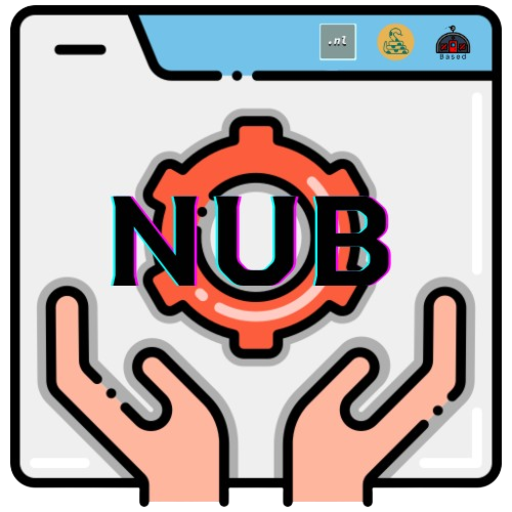

# NUD IDE

NUB IDE repository has [Ukrainian :ukraine:](#мова-програмування-based-ukraine) and [English :uk:](#programming-language-based-uk) localizations

**_Швидкий перехід між розділами:_**

- [NUD IDE](#nud-ide)
  - [Редактор коду NUB IDE :ukraine:](#редактор-коду-nub-ide-ukraine)
    - [Скриншоти](#скриншоти)
    - [Інсталяція](#інсталяція)
    - [Використання](#використання)
    - [Скорочення клавіш](#скорочення-клавіш)
    - [Команди для терміналу NUB IDE](#команди-для-терміналу-nub-ide)
  - [Code editor NUB IDE :ukraine:](#code-editor-nub-ide-ukraine)
    - [Скриншоти](#скриншоти-1)
    - [Інсталяція](#інсталяція-1)
    - [Використання](#використання-1)
    - [Команди для терміналу NUB IDE](#команди-для-терміналу-nub-ide-1)

## Редактор коду NUB IDE :ukraine:

  

**_Редактор коду NUB IDE_** - це простий редактор коду створений для спрощення розробки мовами NikLang, Udav та Based.

### Скриншоти

...

### Інсталяція

...

### Використання

...

### Скорочення клавіш

...

### Команди для терміналу NUB IDE

...

---

## Code editor NUB IDE :uk:

  

**_Code editor NUB IDE_** - це простий редактор коду створений для спрощення розробки мовами NikLang, Udav та Based.

### Скриншоти

...

### Інсталяція

...

### Використання

...

### Команди для терміналу NUB IDE

...
